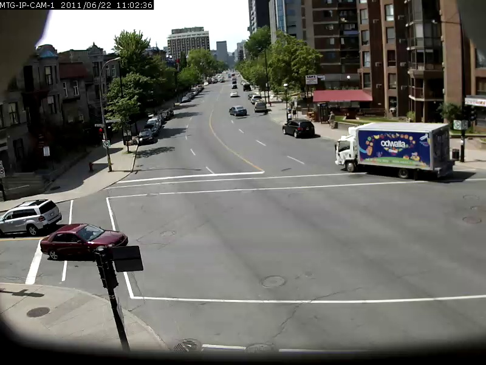
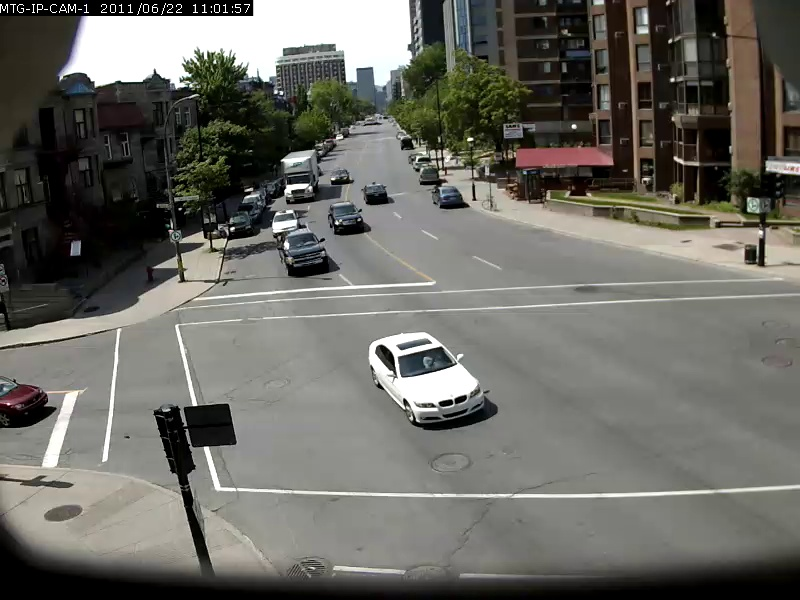
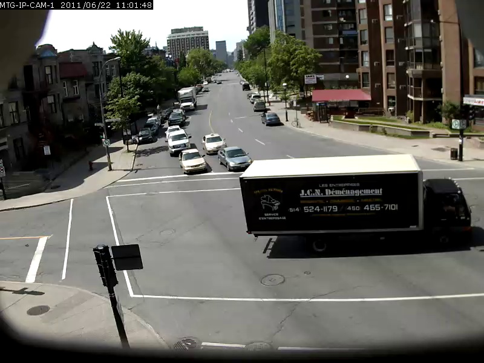
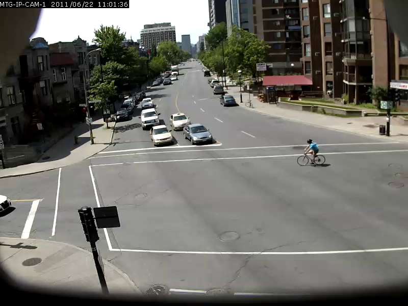
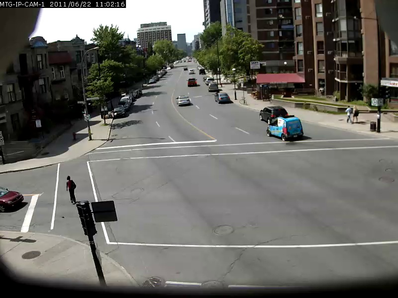

# Contrastive Language-Image Forensic Search


### Overview

CLIFS is a proof-of-concept for free text searching through videos for video frames with matching contents.
This is done using [OpenAI's CLIP](https://openai.com/blog/clip/) model, which is trained to match images with corresponding captions.
The searching is done by first extracting features from video frames using the CLIP image encoder and then
getting the features for the search query through the CLIP text encoder. The features are then matched by similarity
and the top results are returned, if above a set threshold.


### Examples
To give an idea of the power of this model, a few examples are shown below, with the search query in bold and the result below.
These search queries are done against the 2 minute Sherbrooke video from the [UrbanTracker Dataset](https://www.jpjodoin.com/urbantracker/dataset.html).
Only the top image result for each query is shown. Note that the model is in fact quite capable of OCR.

#### A truck with the text "odwalla"

======

#### A white BMW

======


#### A truck with the text "JCN"

======

#### A bicyclist with a blue shirt

======

#### A blue SMART car

======

### Setup
1. Run the setup.sh script to setup the folders and optionally downloading a video file for testing:
```sh
./setup.sh
```

2. Build the search engine and the web server containers:
```sh
docker-compose build
```

2. Start the search engine and web server through docker-compose:
```sh
docker-compose up
```

Optionally, a docker-compose file with GPU support can be used if the host environment has a NVIDIA GPU and is setup for docker GPU support:

```sh
docker-compose -f docker-compose-gpu.yml up
```
 

3. Once the features for the files in the `data/input` directory have been encoded, as shown in the log, navigate to 127.0.0.1:5000 and search away.


